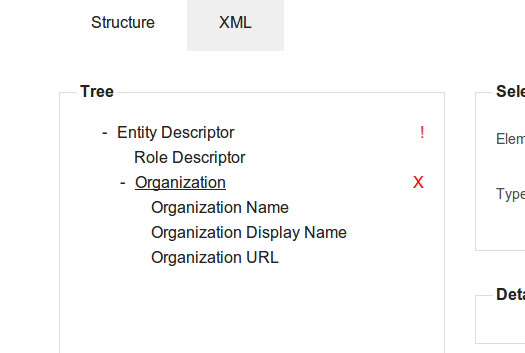
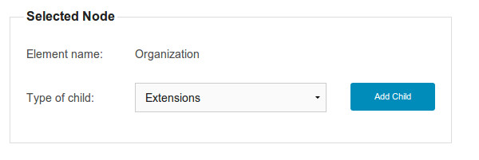
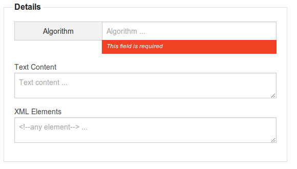

#SAMLMetadata Editor
[Versión Español] (https://github.com/Yaco-Sistemas/saml-metadata-editor/blob/milestone-1/README.md#resumen) | [English Version] (https://github.com/Yaco-Sistemas/saml-metadata-editor/blob/milestone-1/README.md#abstract)
#Legal
	Copyright 2014 Terena. All rights reserved.

	Redistribution and use in source and binary forms, with or without
	modification, are permitted provided that the following conditions
	are met:

	1. Redistributions of source code must retain the above copyright notice,
	    this list of conditions and the following disclaimer.

	2. Redistributions in binary form must reproduce the above copyright notice,
	    this list of conditions and the following disclaimer in the documentation
	    and/or other materials provided with the distribution.

	THIS SOFTWARE IS PROVIDED BY TERENA ``AS IS'' AND ANY EXPRESS OR IMPLIED
	WARRANTIES, INCLUDING, BUT NOT LIMITED TO, THE IMPLIED WARRANTIES OF
	MERCHANTABILITY AND FITNESS FOR A PARTICULAR PURPOSE ARE DISCLAIMED. IN NO
	EVENT SHALL TERENA OR CONTRIBUTORS BE LIABLE FOR ANY DIRECT, INDIRECT,
	INCIDENTAL, SPECIAL, EXEMPLARY, OR CONSEQUENTIAL DAMAGES (INCLUDING, BUT NOT
	LIMITED TO, PROCUREMENT OF SUBSTITUTE GOODS OR SERVICES; LOSS OF USE, DATA, OR
	PROFITS; OR BUSINESS INTERRUPTION) HOWEVER CAUSED AND ON ANY THEORY OF
	LIABILITY, WHETHER IN CONTRACT, STRICT LIABILITY, OR TORT (INCLUDING NEGLIGENCE
	OR OTHERWISE) ARISING IN ANY WAY OUT OF THE USE OF THIS SOFTWARE, EVEN IF
	ADVISED OF THE POSSIBILITY OF SUCH DAMAGE.

	The views and conclusions contained in the software and documentation are those
	of the authors and should not be interpreted as representing official policies,
	either expressed or implied, of Terena.

# Resumen
*SAML Meta Editor* es una aplicacion web que permite editar de forma visual los ficheros de metadatos de protocolo SAML2, según se define en este [documento](http://docs.oasis-open.org/security/saml/v2.0/saml-metadata-2.0-os.pdf).

La aplicación funciona en modo cliente y está realizada con [Underscorejs](http://underscorejs.org/), [Backbonejs](http://backbonejs.org/), [requirejs](http://requirejs.org/), [Jquery](http://jquery.com/) y [Foundation](http://foundation.zurb.com/).

# Instalación.
Como ya hemos indicado es una aplicación web en modo cliente, por lo que podremos desplegarla en cualquier contendedor de aplicaciones que soporte Javascript e ir a la siguiente [dirección](http://localhost:8080/SAMLMetadataEditor/index.htm).

Si por el contrario deseamos incluir la aplicación como modulo en otra ya existente, se deberá tener en cuenta que funciona con requirejs. Por lo que en el código javascript se deberá incluir la vista *SAMLMetaEditorView* renderizada en un contenedor *div*, tal como se muestra a continuación.

		var samlmetaeditorview = new SAMLMetaEditorView();
		$("#samlmetaeditor").html(samlmetaeditorview.render().el);

Para una mayor comprensión indicaremos la responsabilidad de los modulos y ficheros:

 * requirejs : permite modularizar la aplicacion. Se indica un punto de carga al importar la libreria, en nuestro caso el fichero main.js.
 
		
 
 * main.js : como hemos indicado es nuestro punto de entrada. En este fichero cargamos las librerías que son necesarias y realizamos los tratamientos globales. Tras esto se ejecuta la funcion *require* que permite la iniciación de la aplicación.
 * app.js : es el punto de entrada de la aplicación. En este fichero crearemos una variables con la vista del editor de SAML, posteriormente la renderizaremos y agregaremos el codigo HTML al contenedor por Jquery.
 
Es necesario importar requirejs, ya que toda la aplicación esta modularizada con esta librería, sino existiran fallos de tipos indefinidos.
 
# Manual
*SAML Meta Editor* consta de dos pestañas, la primera de ellas nos permite construir el arbol de elementos que definirán los metadatos. La segunda pestaña nos permite ver o editar el documento XML.

## Pestaña *Structure*.
Esta pestaña consta de tres secciones: La primera muestra la estructura del arbol con los nodos que tiene; La segunda muestra una vista general del nodo seleccionado, permitiendo agregar nodos hijos; y la tercera muestra el detalle del nodo, indicando los valores que tiene sus atributos y el contenido del texto.

### Sección *Tree*.
Nos permite ver la estructura del arbol que se va generando y en que nivel se encuentra cada uno de los nodos que lo compone. Esta seccion se compone de los siguientes elementos.

* Expandir o contraer nodo: Cuando un nodo tiene hijos, este podrá contrarse o bien exandirse. Para ello podremos utilizar el '+' o '-' que estará en la parte izquierda del nodo.
* Seleccionar nodo: si pulsamos sobre el nombre de uno de los nodos este se seleccionará y subrayará para indicarnos cual hemos elegido.
* Borrar nodo: cuando seleccionamos un nodo, en la parte derecha de este nos aparecerá una 'X', que nos indica que podemos borrar el nodo seleccionado. Si realizamos está opcion se eliminará el nodo elegido y todos los hijos que dependan de él, tanto de la estructura de arbol como del fichero XML.
* Indicador de errores: cuando existen errores en un nodo porque esté mal contruido se indicará con un signo de exclamación en la parte derecha.

En la siguiente ilustración se puede ver una muestra de la sección donde se muestra los nodos del arbol.

### Seccion *Selected Node*.
Esta pestaña mostrará el nombre del nodo seleccionado, además de permitir agregar un nodo hijo, en el caso de que este pueda tener. Para añadir un nodo hijo se deberá seleccionar el tipo y pulsar sobre el botón *Add Child*.

En la siguiente ilustración se puede ver una muestra de la sección.

### Seccion *Details*
Esta sección muestra el detalle del nodo seleccionado. En ella se mostrará los atributos del nodo, su texto o los elementos XML que no esten definidos en el modelo.

Los primero que se mostrará son los atributos del nodo, a los que se les podrá dar un valor. Si alguno de los valores indicados no es correcto se indicará en la caja de texto correspondiente con un mensaje informativo. Ademas, en el caso de haber un error, se indicará en sección *Tree* con el signo '!' en el nodo.

Si el nodo permite tener texto, se mostrará a continuación una caja de texto en la que se podrá introducir el valor de texto deseado.

Si el nodo permite elementos XML que no son del dominio de SAML, y por lo que no están recogidos en el modelo, a continuación se mostrará una caja de texto para que se pueda introducir los elementos necesarios.

Por último, en el caso de que el nodo necesite de forma obligatoria algún hijo, se indicará con un mensaje informativo.

En la siguiente ilustración se puede ver una muestra de la sección.

## Pestaña *XML*.
Esta pestaña muestra el fichero XML generado, el cual responde al estandar XML de metadatos de SAML2. El texto se mostrará en una caja de texto y se podrá editar, pudiendo cambiar alguno de sus valores si es necesario. El proceso de generación es inverso, es decir, si añadimos un fichero de metadatos validos y pulsamos sobre la pestaña *Structure* se genera el arbol correspondiente.

# Ejemplo.
Para verificar su funcionamiento se puede copiar y pegar en la pestaña XML el siguiente fichero de metadatos SAML2. Si pulsamos sobre la pestaña *Structure* se podrá ver el arbol generado.

		<?xml version="1.0"?>
		<md:EntityDescriptor xmlns:md="urn:oasis:names:tc:SAML:2.0:metadata" xmlns:ds="http://www.w3.org/2000/09/xmldsig#" entityID="https://idp.wierenga.net/simplesaml/saml2/idp/metadata.php">
		  <md:IDPSSODescriptor protocolSupportEnumeration="urn:oasis:names:tc:SAML:2.0:protocol">
		    <md:KeyDescriptor use="signing">
		      <ds:KeyInfo xmlns:ds="http://www.w3.org/2000/09/xmldsig#">
		        <ds:X509Data>
		          <ds:X509Certificate>MIIEhzCCA2+gAwIBAgIPWGgiZx9r52dxjtWbmRzYMA0GCSqGSIb3DQEBBQUAMDYxCzAJBgNVBAYTAk5MMQ8wDQYDVQQKEwZURVJFTkExFjAUBgNVBAMTDVRFUkVOQSBTU0wgQ0EwHhcNMTAwOTA5MDAwMDAwWhcNMTMwOTA4MjM1OTU5WjBgMQswCQYDVQQGEwJOTDEPMA0GA1UEChMGVEVSRU5BMSIwIAYDVQQLExlXaWVyZW5nYS9SZWZlZHMgZ3Vlc3QgSWRQMRwwGgYDVQQDExN3aWVyZW5nYS5yZWZlZHMub3JnMIIBIjANBgkqhkiG9w0BAQEFAAOCAQ8AMIIBCgKCAQEAwuQb3XdJ9rI6ZO3aTDGVOuRtIZZck+InW0eIF1/GKiB3rYt7JJY1MzxzMZB6zISsY3BTwaeJjDfgb2BxDMexJwP7krVTGN5WXRk4fAZ2n5G6QXVyxDM/t5fFT+enKtCAltvB/0rpLg3lV37CU57An/FzZOILzlLvm6KEFFVUttyfs/rG5oWr0aeuzh/nARC/4cP0H+mhm7EYCqyaY0HIpY4eZgjPQXwNRZ0kIshikWeM6v8zwUGmd7e/gqZnc/HC7sCQCNH5f1ueAiS7BezyRmEmt2Cq6CQic7Jx42Ye3sKUZCTgFxp2ZfRTh8LPb24IMO5vlF9ukCq9X8BuQyD99QIDAQABo4IBZjCCAWIwHwYDVR0jBBgwFoAUDL2TaAzz3qujSWsrN1dH6pDjue0wHQYDVR0OBBYEFFLtqs4Jd09X4FlhVxTRfWwVSEccMA4GA1UdDwEB/wQEAwIFoDAMBgNVHRMBAf8EAjAAMB0GA1UdJQQWMBQGCCsGAQUFBwMBBggrBgEFBQcDAjAYBgNVHSAEETAPMA0GCysGAQQBsjEBAgIdMDoGA1UdHwQzMDEwL6AtoCuGKWh0dHA6Ly9jcmwudGNzLnRlcmVuYS5vcmcvVEVSRU5BU1NMQ0EuY3JsMG0GCCsGAQUFBwEBBGEwXzA1BggrBgEFBQcwAoYpaHR0cDovL2NydC50Y3MudGVyZW5hLm9yZy9URVJFTkFTU0xDQS5jcnQwJgYIKwYBBQUHMAGGGmh0dHA6Ly9vY3NwLnRjcy50ZXJlbmEub3JnMB4GA1UdEQQXMBWCE3dpZXJlbmdhLnJlZmVkcy5vcmcwDQYJKoZIhvcNAQEFBQADggEBAI6bUjghHBY5jxeDT5rGKy8WFzjYWQBAVbKf99ZAief7W1MuDf48N0E9BmyTQejaCx+WUSidWKDtjTJrJO5TkiOkoZsKuHnl3S4gUttQebZ0H0tPzB/kddpA51eF9T4DgQwdWwrzwyqhaUBwPMByXuzkt9cdPvqgOZojohU/+M1XicEEzFdyP8OA9o38XvbtYqQeFiCPUqLduWvRZWppdABulZ43H3/h+YE+FUUg3BBkRhiHjfBPDvUtgvaDHtcC/qP1NPfDXFGgQoFUgDOX3bMpy9hw7M5AnCggPXDFkI7r86qQXC8nkFjjkB/zSqrdYWti74drwSQrzzaTzCoVM28=</ds:X509Certificate>
		        </ds:X509Data>
		      </ds:KeyInfo>
		    </md:KeyDescriptor>
		    <md:KeyDescriptor use="encryption">
		      <ds:KeyInfo xmlns:ds="http://www.w3.org/2000/09/xmldsig#">
		        <ds:X509Data>
		          <ds:X509Certificate>MIIEhzCCA2+gAwIBAgIPWGgiZx9r52dxjtWbmRzYMA0GCSqGSIb3DQEBBQUAMDYxCzAJBgNVBAYTAk5MMQ8wDQYDVQQKEwZURVJFTkExFjAUBgNVBAMTDVRFUkVOQSBTU0wgQ0EwHhcNMTAwOTA5MDAwMDAwWhcNMTMwOTA4MjM1OTU5WjBgMQswCQYDVQQGEwJOTDEPMA0GA1UEChMGVEVSRU5BMSIwIAYDVQQLExlXaWVyZW5nYS9SZWZlZHMgZ3Vlc3QgSWRQMRwwGgYDVQQDExN3aWVyZW5nYS5yZWZlZHMub3JnMIIBIjANBgkqhkiG9w0BAQEFAAOCAQ8AMIIBCgKCAQEAwuQb3XdJ9rI6ZO3aTDGVOuRtIZZck+InW0eIF1/GKiB3rYt7JJY1MzxzMZB6zISsY3BTwaeJjDfgb2BxDMexJwP7krVTGN5WXRk4fAZ2n5G6QXVyxDM/t5fFT+enKtCAltvB/0rpLg3lV37CU57An/FzZOILzlLvm6KEFFVUttyfs/rG5oWr0aeuzh/nARC/4cP0H+mhm7EYCqyaY0HIpY4eZgjPQXwNRZ0kIshikWeM6v8zwUGmd7e/gqZnc/HC7sCQCNH5f1ueAiS7BezyRmEmt2Cq6CQic7Jx42Ye3sKUZCTgFxp2ZfRTh8LPb24IMO5vlF9ukCq9X8BuQyD99QIDAQABo4IBZjCCAWIwHwYDVR0jBBgwFoAUDL2TaAzz3qujSWsrN1dH6pDjue0wHQYDVR0OBBYEFFLtqs4Jd09X4FlhVxTRfWwVSEccMA4GA1UdDwEB/wQEAwIFoDAMBgNVHRMBAf8EAjAAMB0GA1UdJQQWMBQGCCsGAQUFBwMBBggrBgEFBQcDAjAYBgNVHSAEETAPMA0GCysGAQQBsjEBAgIdMDoGA1UdHwQzMDEwL6AtoCuGKWh0dHA6Ly9jcmwudGNzLnRlcmVuYS5vcmcvVEVSRU5BU1NMQ0EuY3JsMG0GCCsGAQUFBwEBBGEwXzA1BggrBgEFBQcwAoYpaHR0cDovL2NydC50Y3MudGVyZW5hLm9yZy9URVJFTkFTU0xDQS5jcnQwJgYIKwYBBQUHMAGGGmh0dHA6Ly9vY3NwLnRjcy50ZXJlbmEub3JnMB4GA1UdEQQXMBWCE3dpZXJlbmdhLnJlZmVkcy5vcmcwDQYJKoZIhvcNAQEFBQADggEBAI6bUjghHBY5jxeDT5rGKy8WFzjYWQBAVbKf99ZAief7W1MuDf48N0E9BmyTQejaCx+WUSidWKDtjTJrJO5TkiOkoZsKuHnl3S4gUttQebZ0H0tPzB/kddpA51eF9T4DgQwdWwrzwyqhaUBwPMByXuzkt9cdPvqgOZojohU/+M1XicEEzFdyP8OA9o38XvbtYqQeFiCPUqLduWvRZWppdABulZ43H3/h+YE+FUUg3BBkRhiHjfBPDvUtgvaDHtcC/qP1NPfDXFGgQoFUgDOX3bMpy9hw7M5AnCggPXDFkI7r86qQXC8nkFjjkB/zSqrdYWti74drwSQrzzaTzCoVM28=</ds:X509Certificate>
		        </ds:X509Data>
		      </ds:KeyInfo>
		    </md:KeyDescriptor>
		    <md:SingleLogoutService Binding="urn:oasis:names:tc:SAML:2.0:bindings:HTTP-Redirect" Location="https://idp.wierenga.net/simplesaml/saml2/idp/SingleLogoutService.php"/>
		    <md:NameIDFormat>urn:oasis:names:tc:SAML:2.0:nameid-format:transient</md:NameIDFormat>
		    <md:SingleSignOnService Binding="urn:oasis:names:tc:SAML:2.0:bindings:HTTP-Redirect" Location="https://idp.wierenga.net/simplesaml/saml2/idp/SSOService.php"/>
		  </md:IDPSSODescriptor>
		  <md:Organization>
		    <md:OrganizationName xml:lang="en">Wierenga Netwerken</md:OrganizationName>
		    <md:OrganizationDisplayName xml:lang="en">wierenga.net Guest IdP</md:OrganizationDisplayName>
		    <md:OrganizationURL xml:lang="en">http://www.wierenga.net</md:OrganizationURL>
		  </md:Organization>
		  <md:ContactPerson contactType="technical">
		    <md:SurName>Administrator</md:SurName>
		    <md:EmailAddress>idpadmin@wierenga.net</md:EmailAddress>
		  </md:ContactPerson>
		</md:EntityDescriptor>
		
# Abstract
*SAML Meta Editor* is a web application that allows visually edit metadata files SAML2 protocol, as defined in this [document](http://docs.oasis-open.org/security/saml/v2.0/saml-metadata-2.0-os.pdf).

The application works in client mode and is made with [Underscorejs](http://underscorejs.org/), [Backbonejs](http://backbonejs.org/), [requirejs](http://requirejs.org/), [Jquery](http://jquery.com/) y [Foundation](http://foundation.zurb.com/).

# Installation.
As we have indicated is a web application in client mode, so we can display it in any application that supports contender Javascript and go to the next [dirección](http://localhost:8080/SAMLMetadataEditor/index.htm).

If instead you want to include in the application as an existing module, you should consider running RequireJS. So in the javascript code should include the view *SAMLMetaEditorView* rendered in a container *div*, as shown below.

		var samlmetaeditorview = new SAMLMetaEditorView();
		$("#samlmetaeditor").html(samlmetaeditorview.render().el);

For a better understanding of responsibility indicate modules and files:

 * requirejs : allows to modularize the application. Charge point indicated to import the library, in our case the file main.js.
 
		
 
 * main.js : as we have indicated is our entry point. In this file we load the libraries that are necessary and perform global treatments. After this function is executed *require* allowing the initiation of the application.
 * app.js : is the entry point for the application. This file will create a variable with the SAML editor view, subsequently will render and add the HTML code to Jquery container.
 
RequireJS be imported because the entire application is modularized with this library, but undefined types of failures will exist.
 
# Manual
*SAML Meta Editor* consists of two tabs, the first one allows us to build the tree of elements that define the metadata. The second tab allows you to view or edit the XML document.

## Tab *Structure*.
This tab consists of three sections: The first shows the structure of the tree with nodes having; The second shows an overview of the selected node, allowing you to add child nodes; and the third shows the detail of the node, indicating the values ​​has its attributes and text content.

### Section *Tree*.
We can see the structure of the tree that is generated and what level is each of the nodes that make up. This section consists of the following elements.

* Expand or collapse node: When a node has children, this may contrarse or exandirse. For this we can use the '+' or '-' that will be on the left side of the node.
* Select node: if you click on the name of a node that is selected and highlight to indicate that we have chosen.
* Delete node: When we select a node on the right side of this we will see a 'X', which tells us that we can delete the selected node. If we make is the chosen option node and all the children who depend on it, both the tree structure and the XML file will be deleted.
* Error indicator: when there are errors in a node that is wrong Built is indicated with an exclamation point on the right side.

In the illustration below you can see an example of the section where the nodes of the tree is displayed.

### Section *Selected Node*.
This tab displays the name of the selected node, and allows to add a child node in the event that this may have. To add a child node should select the type and click on the button *Add Child*.

In the illustration below you can see an example of the section.

### Section *Details*
This section shows the detail of the selected node. It attributes of the node, its text or XML elements that are not defined in the model is displayed.

The first to be shown are the attributes of the node, which can be given a value. If any of the values ​​given is not correct is indicated in the corresponding text box with an informational message. Moreover, in the case of an error, shall be indicated in section *Tree*with sign '!' in the node.

If the node can contain text, then displays a text box where you can enter the desired text value.

If the node allows XML elements that are not domain SAML, and so they are not included in the model, then a text box is displayed so you can enter the necessary items.

Finally, if the node need of compulsory one child, will be indicated by an informational message.

In the illustration below you can see an example of the section.

## Tab *XML*.
This tab shows the XML file generated, which responds to the XML standard SAML2 metadata. The text is displayed in a text box and can be edited, and may change any of its values ​​if necessary. The build process is reversed, ie, if we add a valid metadata file and click on the tab *Structure* the corresponding tree is generated.

# Example.
To verify operation you can copy and paste into the XML tab next SAML2 metadata file. If you click on the tab *Structure* may see the tree generated.

		<?xml version="1.0"?>
		<md:EntityDescriptor xmlns:md="urn:oasis:names:tc:SAML:2.0:metadata" xmlns:ds="http://www.w3.org/2000/09/xmldsig#" entityID="https://idp.wierenga.net/simplesaml/saml2/idp/metadata.php">
		  <md:IDPSSODescriptor protocolSupportEnumeration="urn:oasis:names:tc:SAML:2.0:protocol">
		    <md:KeyDescriptor use="signing">
		      <ds:KeyInfo xmlns:ds="http://www.w3.org/2000/09/xmldsig#">
		        <ds:X509Data>
		          <ds:X509Certificate>MIIEhzCCA2+gAwIBAgIPWGgiZx9r52dxjtWbmRzYMA0GCSqGSIb3DQEBBQUAMDYxCzAJBgNVBAYTAk5MMQ8wDQYDVQQKEwZURVJFTkExFjAUBgNVBAMTDVRFUkVOQSBTU0wgQ0EwHhcNMTAwOTA5MDAwMDAwWhcNMTMwOTA4MjM1OTU5WjBgMQswCQYDVQQGEwJOTDEPMA0GA1UEChMGVEVSRU5BMSIwIAYDVQQLExlXaWVyZW5nYS9SZWZlZHMgZ3Vlc3QgSWRQMRwwGgYDVQQDExN3aWVyZW5nYS5yZWZlZHMub3JnMIIBIjANBgkqhkiG9w0BAQEFAAOCAQ8AMIIBCgKCAQEAwuQb3XdJ9rI6ZO3aTDGVOuRtIZZck+InW0eIF1/GKiB3rYt7JJY1MzxzMZB6zISsY3BTwaeJjDfgb2BxDMexJwP7krVTGN5WXRk4fAZ2n5G6QXVyxDM/t5fFT+enKtCAltvB/0rpLg3lV37CU57An/FzZOILzlLvm6KEFFVUttyfs/rG5oWr0aeuzh/nARC/4cP0H+mhm7EYCqyaY0HIpY4eZgjPQXwNRZ0kIshikWeM6v8zwUGmd7e/gqZnc/HC7sCQCNH5f1ueAiS7BezyRmEmt2Cq6CQic7Jx42Ye3sKUZCTgFxp2ZfRTh8LPb24IMO5vlF9ukCq9X8BuQyD99QIDAQABo4IBZjCCAWIwHwYDVR0jBBgwFoAUDL2TaAzz3qujSWsrN1dH6pDjue0wHQYDVR0OBBYEFFLtqs4Jd09X4FlhVxTRfWwVSEccMA4GA1UdDwEB/wQEAwIFoDAMBgNVHRMBAf8EAjAAMB0GA1UdJQQWMBQGCCsGAQUFBwMBBggrBgEFBQcDAjAYBgNVHSAEETAPMA0GCysGAQQBsjEBAgIdMDoGA1UdHwQzMDEwL6AtoCuGKWh0dHA6Ly9jcmwudGNzLnRlcmVuYS5vcmcvVEVSRU5BU1NMQ0EuY3JsMG0GCCsGAQUFBwEBBGEwXzA1BggrBgEFBQcwAoYpaHR0cDovL2NydC50Y3MudGVyZW5hLm9yZy9URVJFTkFTU0xDQS5jcnQwJgYIKwYBBQUHMAGGGmh0dHA6Ly9vY3NwLnRjcy50ZXJlbmEub3JnMB4GA1UdEQQXMBWCE3dpZXJlbmdhLnJlZmVkcy5vcmcwDQYJKoZIhvcNAQEFBQADggEBAI6bUjghHBY5jxeDT5rGKy8WFzjYWQBAVbKf99ZAief7W1MuDf48N0E9BmyTQejaCx+WUSidWKDtjTJrJO5TkiOkoZsKuHnl3S4gUttQebZ0H0tPzB/kddpA51eF9T4DgQwdWwrzwyqhaUBwPMByXuzkt9cdPvqgOZojohU/+M1XicEEzFdyP8OA9o38XvbtYqQeFiCPUqLduWvRZWppdABulZ43H3/h+YE+FUUg3BBkRhiHjfBPDvUtgvaDHtcC/qP1NPfDXFGgQoFUgDOX3bMpy9hw7M5AnCggPXDFkI7r86qQXC8nkFjjkB/zSqrdYWti74drwSQrzzaTzCoVM28=</ds:X509Certificate>
		        </ds:X509Data>
		      </ds:KeyInfo>
		    </md:KeyDescriptor>
		    <md:KeyDescriptor use="encryption">
		      <ds:KeyInfo xmlns:ds="http://www.w3.org/2000/09/xmldsig#">
		        <ds:X509Data>
		          <ds:X509Certificate>MIIEhzCCA2+gAwIBAgIPWGgiZx9r52dxjtWbmRzYMA0GCSqGSIb3DQEBBQUAMDYxCzAJBgNVBAYTAk5MMQ8wDQYDVQQKEwZURVJFTkExFjAUBgNVBAMTDVRFUkVOQSBTU0wgQ0EwHhcNMTAwOTA5MDAwMDAwWhcNMTMwOTA4MjM1OTU5WjBgMQswCQYDVQQGEwJOTDEPMA0GA1UEChMGVEVSRU5BMSIwIAYDVQQLExlXaWVyZW5nYS9SZWZlZHMgZ3Vlc3QgSWRQMRwwGgYDVQQDExN3aWVyZW5nYS5yZWZlZHMub3JnMIIBIjANBgkqhkiG9w0BAQEFAAOCAQ8AMIIBCgKCAQEAwuQb3XdJ9rI6ZO3aTDGVOuRtIZZck+InW0eIF1/GKiB3rYt7JJY1MzxzMZB6zISsY3BTwaeJjDfgb2BxDMexJwP7krVTGN5WXRk4fAZ2n5G6QXVyxDM/t5fFT+enKtCAltvB/0rpLg3lV37CU57An/FzZOILzlLvm6KEFFVUttyfs/rG5oWr0aeuzh/nARC/4cP0H+mhm7EYCqyaY0HIpY4eZgjPQXwNRZ0kIshikWeM6v8zwUGmd7e/gqZnc/HC7sCQCNH5f1ueAiS7BezyRmEmt2Cq6CQic7Jx42Ye3sKUZCTgFxp2ZfRTh8LPb24IMO5vlF9ukCq9X8BuQyD99QIDAQABo4IBZjCCAWIwHwYDVR0jBBgwFoAUDL2TaAzz3qujSWsrN1dH6pDjue0wHQYDVR0OBBYEFFLtqs4Jd09X4FlhVxTRfWwVSEccMA4GA1UdDwEB/wQEAwIFoDAMBgNVHRMBAf8EAjAAMB0GA1UdJQQWMBQGCCsGAQUFBwMBBggrBgEFBQcDAjAYBgNVHSAEETAPMA0GCysGAQQBsjEBAgIdMDoGA1UdHwQzMDEwL6AtoCuGKWh0dHA6Ly9jcmwudGNzLnRlcmVuYS5vcmcvVEVSRU5BU1NMQ0EuY3JsMG0GCCsGAQUFBwEBBGEwXzA1BggrBgEFBQcwAoYpaHR0cDovL2NydC50Y3MudGVyZW5hLm9yZy9URVJFTkFTU0xDQS5jcnQwJgYIKwYBBQUHMAGGGmh0dHA6Ly9vY3NwLnRjcy50ZXJlbmEub3JnMB4GA1UdEQQXMBWCE3dpZXJlbmdhLnJlZmVkcy5vcmcwDQYJKoZIhvcNAQEFBQADggEBAI6bUjghHBY5jxeDT5rGKy8WFzjYWQBAVbKf99ZAief7W1MuDf48N0E9BmyTQejaCx+WUSidWKDtjTJrJO5TkiOkoZsKuHnl3S4gUttQebZ0H0tPzB/kddpA51eF9T4DgQwdWwrzwyqhaUBwPMByXuzkt9cdPvqgOZojohU/+M1XicEEzFdyP8OA9o38XvbtYqQeFiCPUqLduWvRZWppdABulZ43H3/h+YE+FUUg3BBkRhiHjfBPDvUtgvaDHtcC/qP1NPfDXFGgQoFUgDOX3bMpy9hw7M5AnCggPXDFkI7r86qQXC8nkFjjkB/zSqrdYWti74drwSQrzzaTzCoVM28=</ds:X509Certificate>
		        </ds:X509Data>
		      </ds:KeyInfo>
		    </md:KeyDescriptor>
		    <md:SingleLogoutService Binding="urn:oasis:names:tc:SAML:2.0:bindings:HTTP-Redirect" Location="https://idp.wierenga.net/simplesaml/saml2/idp/SingleLogoutService.php"/>
		    <md:NameIDFormat>urn:oasis:names:tc:SAML:2.0:nameid-format:transient</md:NameIDFormat>
		    <md:SingleSignOnService Binding="urn:oasis:names:tc:SAML:2.0:bindings:HTTP-Redirect" Location="https://idp.wierenga.net/simplesaml/saml2/idp/SSOService.php"/>
		  </md:IDPSSODescriptor>
		  <md:Organization>
		    <md:OrganizationName xml:lang="en">Wierenga Netwerken</md:OrganizationName>
		    <md:OrganizationDisplayName xml:lang="en">wierenga.net Guest IdP</md:OrganizationDisplayName>
		    <md:OrganizationURL xml:lang="en">http://www.wierenga.net</md:OrganizationURL>
		  </md:Organization>
		  <md:ContactPerson contactType="technical">
		    <md:SurName>Administrator</md:SurName>
		    <md:EmailAddress>idpadmin@wierenga.net</md:EmailAddress>
		  </md:ContactPerson>
		</md:EntityDescriptor>
